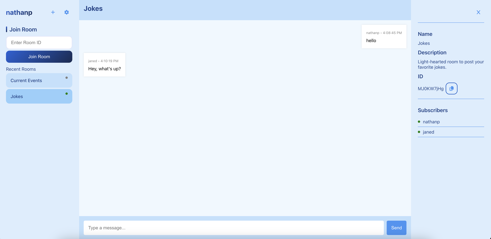

# Go Chatroom

A simple real-time chatroom application built with Go and React.

## Features

- Real-time messaging using WebSockets
- Support for multiple chatrooms
- User accounts with JWT authentication
- RESTful API
- Server events/notifications via WebSocket
- Data persistence (rooms, chat history, etc.)
- User-friendly web interface
- Metrics

## Technologies Used

- Golang
- Gorilla WebSocket
- JWT (JSON Web Tokens)
- PostgreSQL
- Testify (testing framework)
- React, React Router
- CSS
- Javascript
- Docker (development)
- Terraform
- AWS
- Nginx

## Development Installation

**Clone the repository:**
```bash
git clone https://github.com/npezzotti/gochat.git
cd gochat
```

**Install dependencies:**
```bash
go get ./...
```

**Build and run the application:**
```bash
make run
```

**Open your browser:**
Visit `http://localhost:8080`

## Screenshots



## Project Structure

```
gochat/
├── cmd/
├── frontend/
├── internal/
└── terraform/
```

* `cmd/server`: Main entrypoint of the server
* `frontend/`: React applicaiton and other JS comprising the UI
* `internal/api`: REST API, HTTP handlers, middleware, and authentication
* `internal/config`: Configuration
* `internal/database/`: Database interfaces and migrations
* `internal/server/`: Chat server
* `internal/stats/`: Metrics system
* `internal/testutil/`: Test utils
* `internal/types/`: Types used by both the chat server and API
* `terraform/`: Terraform code and scripts used to provision infrastucture in AWS and deploy application

## Why I Built This

I created this project to deepen my understanding of real-time web applications and Go's concurrency model. It also serves as a showcase of my ability to design and implement scalable backend systems.
